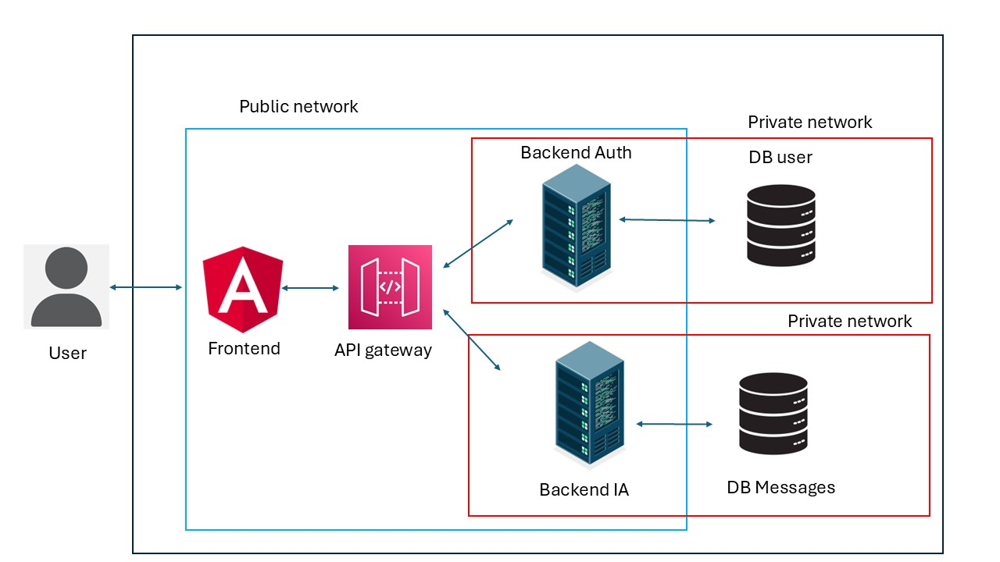
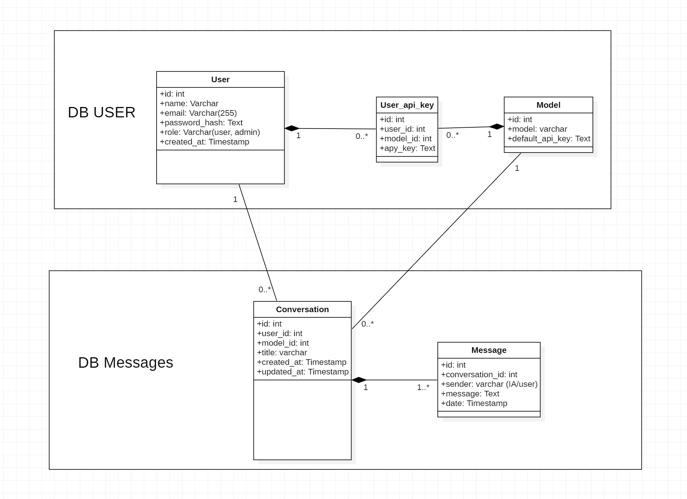
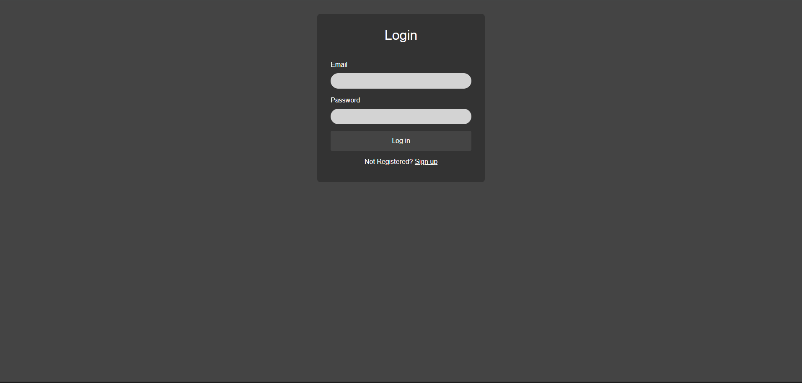
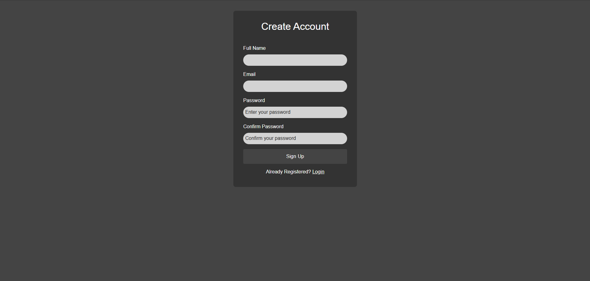
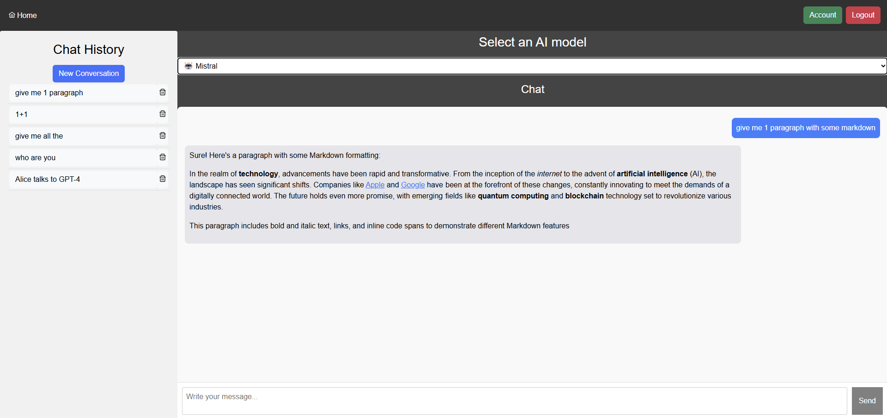
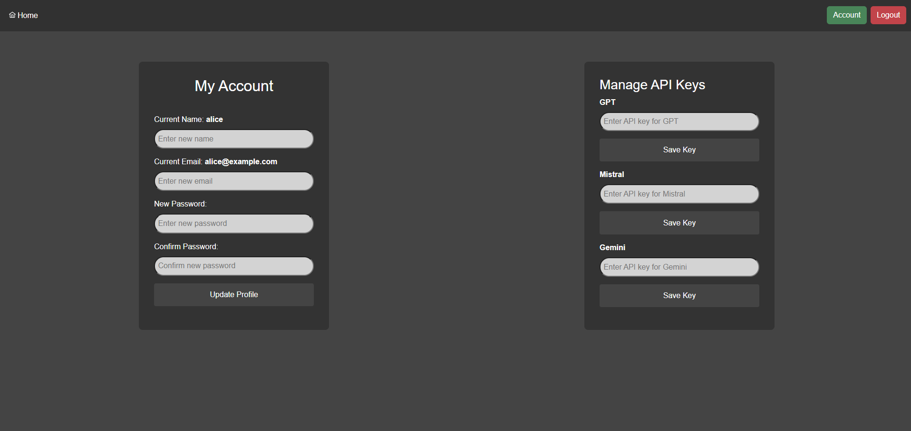

# Multi-LLM
## Table of Contents
1. [Introduction](#1-introduction)
2. [Structure of the project](#2-structure-of-the-project)
3. [How to run](#3-how-to-run)

## 1. Introduction
***
The goal of this project was to create a platform that allows users to interact with multiple Large Language Models (LLMs) (For the moment only Gemini and Mistral are available) and seamlessly switch between them while maintaining the same conversation context.
Typically, when switching from one LLM to another, the conversation context is lost, and the new model starts from scratch. To address this limitation, we built a solution that preserves the conversation history across models, enabling a smooth and continuous interaction.
By default, the platform uses pre-configured API keys, but users can also input their own keys to ensure the privacy of their conversations, in accordance with the data policies of each individual LLM provider.

<span style="color: red; font-weight: bold;">This project was originally hosted on a private GitLab server as part of an open-ended school assignment.I've decided to publish it on my personal GitHub because I believe it's an interesting project worth sharing. If I find the time, I plan to improve the frontend, which is currently quite basic and add GPT to the LLM available.</span>


## 2. Structure of the project
***
We structured the project using a **microservices architecture**, with:

- A dedicated service for **authentication**
- A separate service for **conversation management and AI interactions**

Additionally, we use an **API Gateway** to centralize all our APIs. This greatly simplifies integration with the frontend. We’ve also integrated **Swagger** within the gateway to clearly visualize all available endpoints and to ease maintenance by enabling automatic service generation for the frontend.

The frontend is built with **Angular** and we enabled **hot reloading with Docker**, so frontend developers don’t need to rebuild the Docker image on every change — unless new dependencies are added to the `node_modules`.

### Architecture Overview
***



### Tech Stack Overview
***

- **2 Express.js backends**:
  - [api-gateway](./api-gateway/)
  - [backend-auth](./backend-auth)

- **1 Rust backend** using `actix-web`:
  - [backend-ai](./backend-ai)

- **2 PostgreSQL databases**:
  - [database](./database)

- **1 Angular frontend**:
  - [frontend](./frontend)

### Database Schema
***

Here's a schema of our database structure:



### Security
***

Security is a key priority in this project, we have implemented:

- **JWT authentication with HTTP-only cookies**, including refresh tokens to expire sessions after a set duration
- **Password hashing**
- **API key encryption**
- **Private database network access**, meaning the databases are **not exposed** to the public internet


## 3. How to run
***
You need to create different .env file in each folder (api, front, gateway, db) with the following content:

at the root of the project : 
```
USER_DB_PORT=5433
USER_DB_USER_NAME=user
USER_DB_USER_PW=1234
USER_DB_NAME=db_users

MESSAGE_DB_PORT=5432
MESSAGE_DB_USER_NAME=user
MESSAGE_DB_USER_PW=1234
MESSAGE_DB_NAME=db_messages
```

in the frontend folder :
```
BACKEND_SERV=localhost # if launch locally
BACKEND_PORT=4000
```

in the api-gateway folder :
```
BACKEND_AUTH_SERV=localhost # if launch locally
BACKEND_AUTH_PORT=3000
BACKEND_AI_SERV=localhost # if launch locally
BACKEND_AI_PORT=8080
JWT_SECRET=MySuperJWTKey12345!
```

in the backend-auth folder :
```
DB_PORT=5433
DB_NAME=db_users
DB_SERV=localhost # if launch locally
DB_USER_NAME=user
DB_USER_PW=1234
ENCRYPTION_KEY= # Your key
JWT_SECRET=MySuperJWTKey12345!
REFRESH_SECRET=MySuperRefreshJWTKey12345!
```

in the backend-ai folder :
```
DB_PORT=5432
DB_NAME=db_messages
DB_SERV=localhost # if launch locally
DB_USER_NAME=user
DB_USER_PW=1234
DECRYPTION_KEY= # Your key
```

Now you need to encrypt the default api key for the ai service using the Encryption key and put it in the [user database](./database/db_users.sql).

After creating these file you can launch the project locally if you have node and rust installed on your computer ( you will need to create also 2 postgres databases with the info in the .env of the root folder). You can also launch the projec tusing docker using ```docker compose up``` in the root folder of the project and it will launch the project.

Now you will find yourself on the Login page of the website. Default users are creted you can use the following to login:
- email: alice@example.com
- password: 1234



or you can create an account



After that you will found yourself on the main page and you can start asking thing to the AI, Gemini and Mistral (GPT is currently not available, as we’re still in the process of integrating it. You won’t be able to interact with it for now.) 



and you can also put your API key on the account page.

